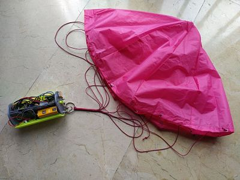

# Cansat accesible
Documentación sobre como realizar proyectos cansat accesibles en diferentes plataformas

## Arduino
* **[Cansat Educativo con Arduinoblocks](https://leobotmanuel.github.io/cansat-educativo/)**: Información del proyecto ampliada y actualizada, gracias a *@leobotmanuel*.
*  [Cansat accesible Arduino](https://docs.google.com/document/d/1QRhxX2xTp3BpBRwgUQqSLYbY-pM_tBMuI9699WiVhyg/edit?usp=sharing): documento compartido

## Micro:bit
* [Cansat accesible con micro:bit](/microbit/cansat_microbit.pdf)

